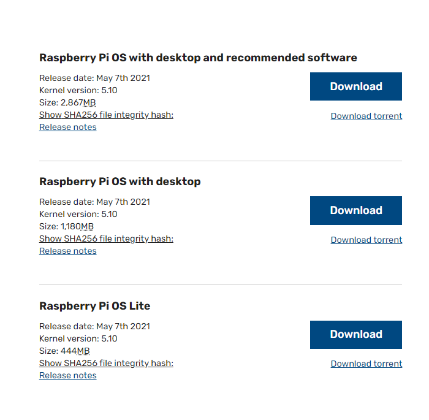
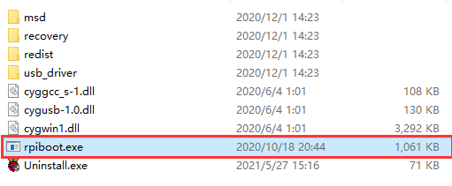
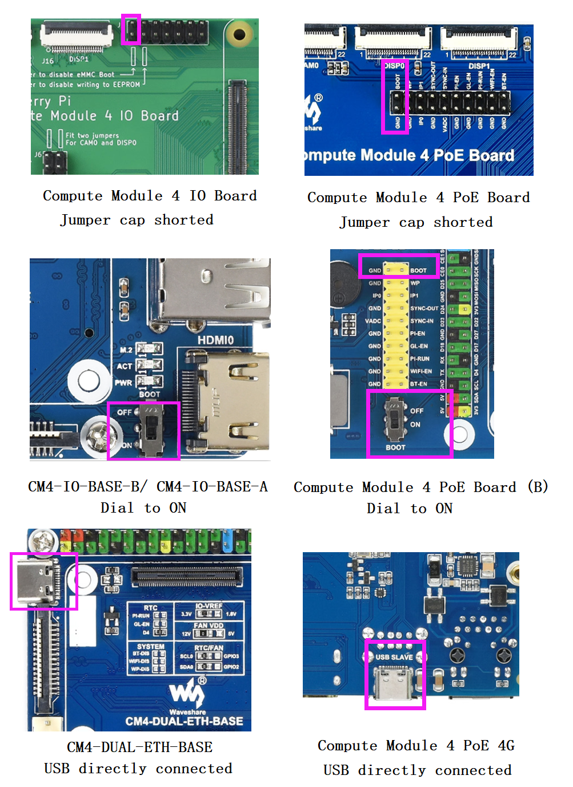
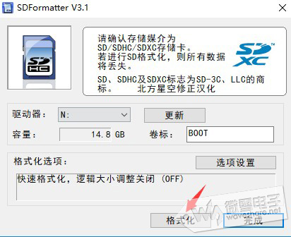
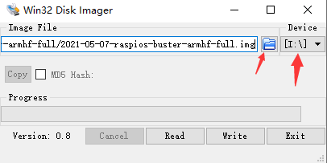

# CM4烧录系统

----------------------------------------------

EMMC 版本不可以使用SD卡

1. 下载系统（ [戳我下载](https://www.raspberrypi.com/software/operating-systems/) ）下载最新发布的系统（或如图所示）。如果下载的是种子文件，使用使用迅雷或彗星等软件再下载

带有桌面和推荐软件的镜像(Raspberry Pi OS with desktop and recommended software)，建议EMMC 16G 或者CM4 lite 16G内存卡以上的储存空间使用

2. 下载并以管理员权限打开软件rpiboot软件（ [戳我下载](https://www.waveshare.net/w/upload/f/f3/Rpiboot_setup.zip) ) ， 以安装驱动程序和启动工具。安装成功之后在安装目录下有一个rpiboot.exe的应用

3. 将BOOT和GND连接 或者 将开关拨至ON，可以在对应产品的WIKI的板载资源，查看BOOT管脚位置，例如如下：

4. 先通过Micro USB /Type C 接口（SLAVE 接口） 转USB接口 连接电脑，再连接电源，部分板子需要额外供电
5. 如果连接电脑并且给主板供电，电脑设备管理器中会识别出一个BCMxxx的设备

> 然后运行rpiboot（步骤2安装）

> 等待运行结束，在我的电脑上面会出现一个U盘的盘符

 注意：如果电脑没有识别出BCMxxx的设备 ，可能是上面哪一个步骤有问题。一定要识别出BCMxxx的设备运行rpiboot 才会有效，否则无效。 如果你没办法正常烧录程序，请尝试以下步骤：  

* 使用WIN10系统进行烧录，多数客户反馈WIN7或linux系统烧录不稳定。
* 确定你的CM4版本是否正常，eMMC正面会多一颗IC。只有eMMC版本的，才可以通过当前方式烧录。
* 注意Power接口需要接入至少10W(5V/2A或者12V/1A)电源适配器。
* 更换一条USB数据线。
* 更换一个PC机的USB接口。
* 尝试重启PC机。
* 尝试重新拔插CM4
* 尝试在另一台电脑烧录。

6. 格式化SD卡：使用SDFormatter.exe（ [点击这里下载](https://www.waveshare.net/w/upload/d/d7/Panasonic_SDFormatter.zip) ） 软件格式化SD 卡。或者使用WIN自带的磁盘管理删除分区。删除分区之后重新建立分区即可。
   此电脑右键 -> 管理 -> 磁盘管理 -> 找到新添加的盘符（选择错了就完蛋了） -> 删除所有分区 -> 建立一个分区（任意文件系统）  
   如果是烧录过系统会有两个盘符，不要管直接格式化或者删除分区就好了

7. 烧写镜像：用Win32DiskImager.exe（[点这里下载](https://www.waveshare.net/w/upload/7/76/Win32DiskImager.zip) ）烧写镜像。选择要烧写的镜像（步骤1下载的），点击“Write”进行烧写，烧录完成后，会提示你是否要格式化，这里需要点击取消

8. 烧录完毕之后，在我的电脑会识别出一个U盘的盘符

 注意：如果使用最新的树莓派OS（2021年10月30号之后的镜像）USB2.0是默认是OTG模式，不过在部分底板上面添加的HUB芯片，CM4会报错：  

