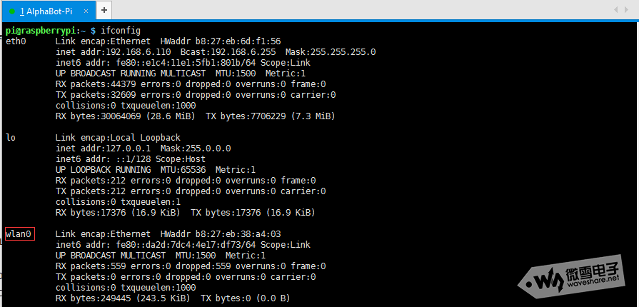
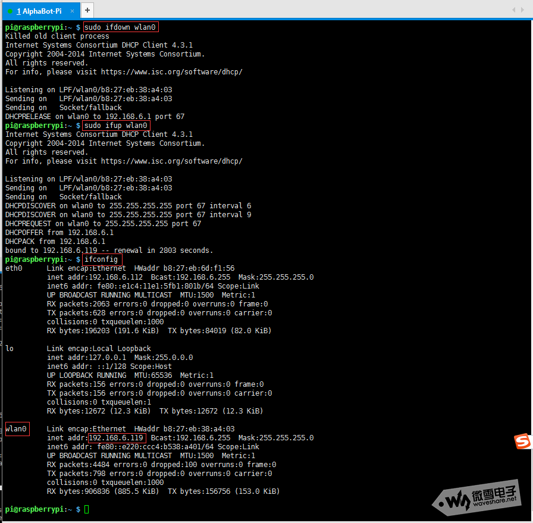

# configurate raspi wifi

## WIFI 设置

* 树莓派连接wifi的方法有很多，一是在树莓派刚开箱的时候，用户可以在未启动树莓派的状态下单独修改/boot/wpa_supplicant.conf文件配置WiFi 的 SSID 和密码，这样树莓派启动后会自行读取 wpa_supplicant.conf 配置文件连接 WiFi 设备。  
* 操作方法简单：将刷好 Raspbian 系统的 SD 卡用电脑读取。在 boot 分区，也就是树莓派的/boot目录下新建wpa_supplicant.conf文件，按照下面的参考格式填入内容并保存 wpa_supplicant.conf 文件.

```shell
country=CN
ctrl_interface=DIR=/var/run/wpa_supplicant GROUP=netdev
update_config=1
network={
ssid="WiFi-A"
psk="12345678"
key_mgmt=WPA-PSK
priority=1
}
network={
ssid="WiFi-B"
psk="12345678"
key_mgmt=WPA-PSK
priority=2
scan_ssid=1
}
```

* 说明WiFi 配置示例：

* 开启ssh，在烧写好镜像的sd卡根目录下新建一个命名为“ssh”的文件，保存即可。

  

* 树莓派开机，再通过ip扫描软件获取树莓派的ip地址即可通过ssh连接树莓派。  

   

## 设置WiFi连接的另一种方法

* 运行如下命令查看网卡信息，若有wlan0则已经识别无线网卡

```shell
ifconfig
```



* 打开配置文件并修改

```shell
sudo vi /etc/wpa_supplicant/wpa_supplicant.conf
```

* 在文件的底部添加下面语句

```shell
network={

ssid=“waveshare_1013”

psk="waveshare"

}
```

* 其中ssid为你要链接的wifi账号，psk为wifi密码。后面改为对应的wifi账号密码。
* 重启网卡使设置生效

```shell
sudo ifdown wlan0
sudo ifup wlan0
```



* 或者直接使用sudo reboot命令重启树莓派
* 把树莓派WiFi获取的IP设置成静态固定IP:

```shell
sudo nano /etc/dhcpcd.conf
```


* 按照以上格式输入最后四句
* 保存后，重启生效。