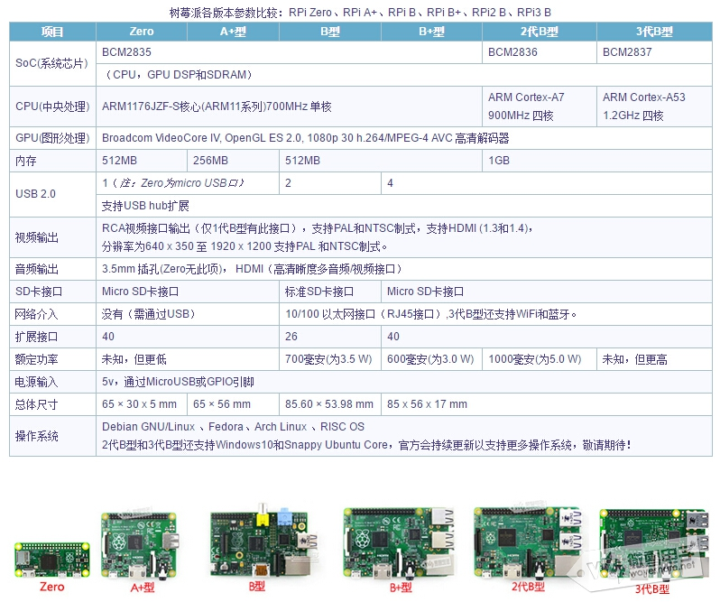

# 什么是树莓派？？ 认识树莓派

------------------------------------------

树莓派是什么？Raspberry Pi(中文名为“树莓派”,简写为RPi，或者RasPi/RPi)是为学生计算机编程教育而设计，只有信用卡 大小的卡片式电脑，其系统基于Linux。  

第一次接触树莓派的时候也是刚学linux系统。抱着玩玩的心态买了一块树莓派B+,刚拿到手的是有点和想象的不一样，就只有一个盒子装在，真的只有一张信用卡大小，真的很吃惊。自己动手刷了一个系统启动起来的时候真的很神奇，这小小的身板真的是五脏俱全,一个便携的mini pc.然后就一发不可收拾，玩得不亦乐乎。SSH登陆，xrdp远程桌面，家庭影院，LAMP服务器，SAMBA服务器等等，它不但是一个卡式电脑，更重要的是它引出40个管脚。这就可以做更多的事情了。  

就让我们一起走进树莓的世界……  

