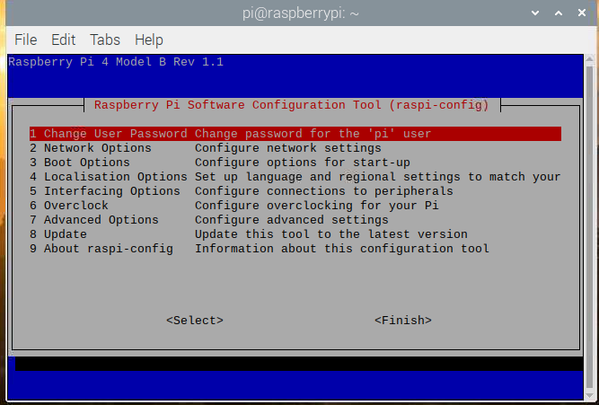

# 树莓派raspi-config配置

-------------------------------------------------

第一次使用树莓派的时候需要进行一些简单的配置，在终端运行如下命令进入配置界面。

```shell
sudo raspi-config
```



* Change User Password 改变默认pi用户的密码，按回车后输入pi用户的新密码。
* Network Options 网络设置选项。
    * Hostname  在网上邻居或者路由器能看到的主机名称
    * Wireless LAN Wifi连接，输入无线网络的名称和密码。
    * Network interface name 启用/禁用可预测网络接口名称。
    * Network proxy setting 配置网络代理设置
* boot options 启动选项
    * desktop/CLI 桌面/ CLI
  
 ```shell
console 控制台   
console autologin 控制台登录    
desktop 桌面   
desktop autologin 桌面登陆
```
 
    * Wait for Network at Boot 等待开机时的网络
    * Splash Screen 选择图形启动屏幕或文本引导
    * Boot Order 选择网络或USB设备引导
    * Boot ROM Version 选择最新或默认引导ROM软件
* Internationalisation Options 国际化选项，可以更改默认语言
    * Change Locale
      语言和区域设置。选中zh-cn然后回车
    * Change Timezone
      设置时区，如果不进行设置，Pi的时间就显示不正常。
    * Change Keyboard Layout 改变键盘布局,国内多使用PC104标准键盘，
      一般设置如下：
```shell
->Generic 104-key PC 

     ->English(US) 

       ->The default for the keyboard layout 

         ->No compose key

           ->ctrl_alt_backspace Yes
```

    * Change WLAN Country 设置网络所在的国家或地区

<br>

* Interfacing Option 配置与外围设备的连接
    * P1 Camera 是否开启摄像头
    * P2 SSH 是否运行SSH登录，建议开户此选项，以后操作PI方便， 有网络就行，不用开屏幕了。
    * P3 VNC 是否开启VNC
    * P4 SPI 是否默认启动SPI内核驱动
    * P5 I2C是否默认启动I2C内核驱动
    * P6 Serial 是否默认启动串口调试

<br>

* Overclock（超频可能导致树莓派损坏，如无特殊要求，不建议超频）
    * None 不超频，运行在700Mhz，核心频率250Mhz，内存频率400Mhz，不增加电压
    * Modest 适度超频，运行在800Mhz，核心频率250Mhz，内存频率400Mhz，不增加电压
    * Medium 中度超频，运行在900Mhz，核心频率250Mhz，内存频率450Mhz，增加电压2
    * High 高度超频，运行在950Mhz，核心频率250Mhz，内存频率450Mhz，增加电压6
    * Turbo 终极超频，运行在1000Mhz，核心频率500Mhz，内存频率600Mhz，增加电压6
    * Pi2 2代专有的超频，运行在1000Mhz，核心频率500Mhz，内存频率500Mhz，增加电压2

<br>

* Advanced Options 高级设置
    * A1 Expand Filesystem Ensure that all of card storage is available 扩展文件系统确保所有卡存储都可用
    * A2 Overscan 是否让屏幕内容全屏显示
    * A3 Memory Split 内存分配，选择给GPU多少内存
    * A4 Audio 选择声音默认输出到模拟口还是HDMI口i
    * A5 Resolution 设置特定的屏幕分辨率
    * A6 Screen Blanking 启用/禁用屏幕消隐
    * A7 Pixel Doubling 启用/禁用2x2像素映射
    * A8 GL Driver 启用/禁用实验桌面GL驱动程序
    * A9 Compositor 启用/禁用xcompmgr组合管理器
    * AA Pi 4 Video output Pi 4的视频输出选项
    * AB Overlay FS 启用/禁用只读文件系统
<br>

* Update 将此工具更新到最新版本

  <br>
* About raspi-config 关于raspi-config的信息。


-------------------------------------------------------------------------------

- 若想改中文，须安装中文字体，命令如下：
```shell
sudo apt-get update  
sudo apt-get install ttf-wqy-zenhei ttf-wqy-microhei
```

- 初次启动树莓派要设置Internationalisation Options选项
    - Change Locale设置语言，默认为英文
    - 移动到屏幕底部，用空格键选中zh-CN.GBK GBK 和 zh_CN.UTF-8 UTF-8两项,然后按回车，然后默认语言选中zh-CN.UTF-8，然后回车。
    - 安装拼音输入法
```shell
sudo apt-get install scim-pinyin
```

    - change Timezone 设置时区，选择Asia（亚洲）再选择shanghai（上海）。
    - Change Keyboard Layout 改变键盘布局

## wifi 设置

- 运行如下命令查看网卡信息，若有wlan0则已经识别无线网卡

```shell
ifconfig
```

- 打开配置文件并修改

```shell
sudo vi /etc/wpa_supplicant/wpa_supplicant.conf
```

- 在文件的底部添加下面语句

```shell
network={

ssid=“waveshare_1013”

psk=”waveshare”

}

```

> 其中ssid为你要链接的wifi账号，psk为wifi密码。后面改为对应的wifi账号密码。
> 重启网卡使设置生效

```shell
sudo ifup wlan0
```

> 或者直接使用sudo reboot命令重启树莓派。