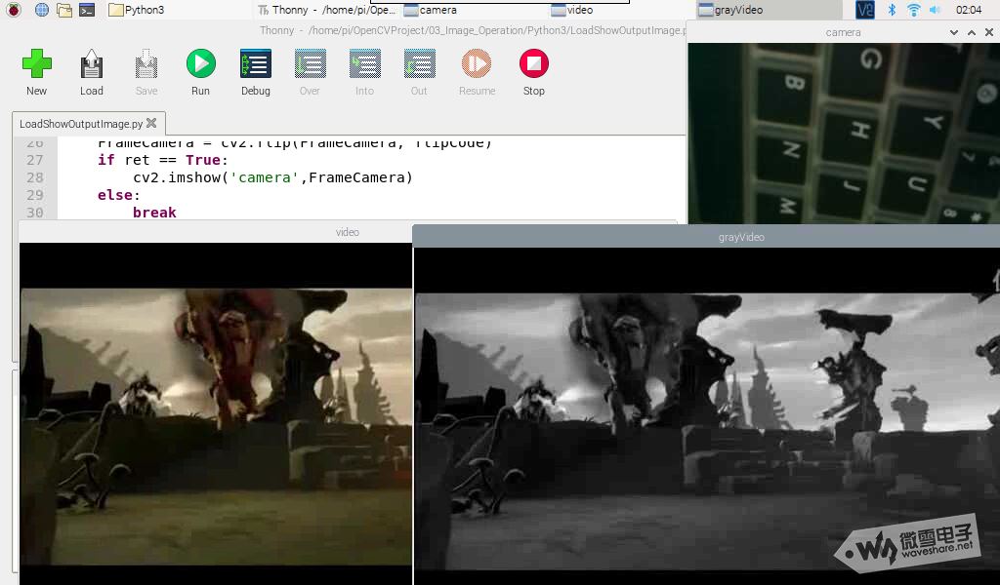

# 图像与视频载入、显示、输出
---------------------------------------------

## 1. 图像的载入,显示，与输出

### 1.1 Python3

现在通过一个demo来认识Python3中图像的载入，显示，与输出操作：

```python
import cv2
import numpy as np

# default read as BGR picture
img1 = cv2.imread('color.jpg')
# show it in the window
cv2.imshow('image1',img1)
# write it to local disk
cv2.imwrite('image1.jpg',img1)

# read as grayscale picture
img2 = cv2.imread('color.jpg',cv2.IMREAD_GRAYSCALE)
# show it in the window
cv2.imshow('image2',img2)
# write it to local disk
cv2.imwrite('image2.jpg',img2)

cv2.waitKey(0)
cv2.destroyAllWindows()
```

实际运行效果如下图所示，在运行后，在python文件路径下可找到image1.jpg，image2.jpg文件，且image2.jpg是灰度图像。

### 1.2 C++

C++源码类似如下：

```c++
#include<opencv2/core/core.hpp>
#include<opencv2/highgui/highgui.hpp>
using namespace cv;

int main(void)
{
    Mat img1=imread("color.jpg");
    namedWindow("image1");
    imshow("image1",img1);
    imwrite("image1.jpg",img1);

    Mat img2=imread("color.jpg",IMREAD_GRAYSCALE);
    namedWindow("image2");
    imshow("image2",img2);
    imwrite("image2.jpg",img2);

    waitKey(0);
    return 0;
}
```

## 2 视频，摄像头的载入，显示

### 2.1 Python3

现在通过一个demo来理解Python3中视频，摄像头的载入与显示操作,且在该操作中，包含了摄像头的翻转，摄像头开窗定义等。

同时还包含了视频的载入，显示操作；注意，OpenCV只支持读取avi格式的视频，并且不包含音频。

```python
import cv2

capCamera = cv2.VideoCapture(0)
if(not capCamera.isOpened()):
    print("can't open this camera")
    exit(0)

capVideo = cv2.VideoCapture('demo.avi')
if(not capVideo.isOpened()):
    print("can't open this video")
    exit(0)

# set the image width and height
capCamera.set(cv2.CAP_PROP_FRAME_WIDTH, 320)
capCamera.set(cv2.CAP_PROP_FRAME_HEIGHT, 240)

## image flip setup
# * horizontal flip:  flipCode = 1
# * Vertical flip:  flipCode = 0
# * horizontal & Vertical flip:  flipCode = -1
flipCode = -1

while(True):
    # handle for the camera
    ret, FrameCamera = capCamera.read()
    FrameCamera = cv2.flip(FrameCamera, flipCode)
    if ret == True:
        cv2.imshow('camera',FrameCamera)
    else:
        break

    # handle for the video
    ret, FrameVideo = capVideo.read()
    if ret == True:
        cv2.imshow('video',FrameVideo)
        FramVideoGray = cv2.cvtColor(FrameVideo,cv2.COLOR_BGR2GRAY)
        cv2.imshow('grayVideo',FramVideoGray)
    else:
        break

    # handle for exit
    if (cv2.waitKey(1)) == ord('q'):
        break

capCamera.release()
cv2.destroyAllWindows()
```

实际运行效果如下图所示：



### 2.2 C++

其C++源码类似如下：

```c++
#include<iostream>
#include<opencv2/opencv.hpp>
#include<opencv2/highgui/highgui.hpp>
#include<opencv2/imgproc/imgproc.hpp>

using namespace std;
using namespace cv;

int main()
{
    VideoCapture capCamera(0);
    if(!capCamera.isOpened())
    {
        cout<<"can't open this camera"<<endl;
        return -1;
    }
    VideoCapture capVideo("demo.avi");
    if(!capVideo.isOpened())
    {
        cout<<"can't open this video"<<endl;
        return -1;
    }
    capCamera.set(CAP_PROP_FRAME_WIDTH, 320);
    capCamera.set(CAP_PROP_FRAME_HEIGHT, 240);

    Mat FrameCamera,FrameVideo;

    // image flip setup
    // horizontal flip:  flipCode = 1
    // Vertical flip:  flipCode = 0
    // horizontal & Vertical flip:  flipCode = -1
    int flipCode = -1;

    while(1)
    {    
        //read by operator ">>"
        capCamera>>FrameCamera;
        flip(FrameCamera,FrameCamera,flipCode);
        imshow("camera",FrameCamera);

        //read by function read
        bool ret = capVideo.read(FrameVideo);
        if(ret == true)
        {
            imshow("video",FrameVideo);
            cvtColor(FrameVideo,FrameVideo,COLOR_BGR2GRAY);
            imshow("grayVideo",FrameVideo);
        }
        else
        {
            break;
        }

        if(char(waitKey(1)) == 'q')
        {
            break;
        }
    }
    capCamera.release();
    capVideo.release();
    destroyAllWindows();
    return 0;
}
```

## 3 视频，摄像头的输出

本节主要讲解视频，摄像头的输出，即，将视频流数据保存到本地。

OpenCV只支持生成avi格式的视频，且生成的视频文件不能大于2G，且不能添加音频。

### 3.1 Python3

关于视频输出，主要用到VideoWriter对象，而视频的输入，主要用到VideoCapture对象，因此，视频的输出(视频录制)的主要过程就是将VideoCapture中读入的图片写入到VideoWriter当中，在给出demo程序之前，先给出VideoWrite的使用方法：  

```python
# Encode the video format as MJPG
fourcc = cv2.VideoWriter_fourcc('M','J','P','G')
print(fourcc)
# Config the framrate to 20 frame per second
# fps = capCamera.get(cv2.CAP_PROP_FPS)
fps = 20.0
print(fps)
# Config the Window Size by camera
frameSize = (int(capCamera.get(cv2.CAP_PROP_FRAME_WIDTH)),int(capCamera.get(cv2.CAP_PROP_FRAME_HEIGHT)))
print(frameSize)
# Create the VideoWrite Object
outCamera = cv2.VideoWriter('outputCamera.avi',fourcc,fps,frameSize)
```

首先，在写入视频的时候，必须先指定视频的编码格式，这里我们指定为MJPG格式。  

```python
fourcc = cv2.VideoWriter_fourcc('M','J','P','G')
```

接着，须指定视频的帧率跟窗口大小。

```python
# Config the framrate to 20 frame per second
# fps = capCamera.get(cv2.CAP_PROP_FPS)
fps = 20.0
print(fps)
# Config the Window Size by camera
frameSize = (int(capCamera.get(cv2.CAP_PROP_FRAME_WIDTH)),int(capCamera.get(cv2.CAP_PROP_FRAME_HEIGHT)))
print(frameSize)
```

最后，初始化VideoWriter的时候，将这些参数传入到其中。并指定输出视频文件的名称。

```python
# Create the VideoWrite Object
outCamera = cv2.VideoWriter('outputCamera.avi',fourcc,fps,frameSize)
```

接下来，将给出源码：

```python
import cv2
import numpy as np

#--------------------------------
# set for camera
capCamera = cv2.VideoCapture(0)
capCamera.set(cv2.CAP_PROP_FRAME_WIDTH,640)
capCamera.set(cv2.CAP_PROP_FRAME_HEIGHT,480)

# set for camera output
fourcc = cv2.VideoWriter_fourcc('M','J','P','G')
print(fourcc)
# fps = capCamera.get(cv2.CAP_PROP_FPS)
fps = 20.0
print(fps)
frameSize = (int(capCamera.get(cv2.CAP_PROP_FRAME_WIDTH)),int(capCamera.get(cv2.CAP_PROP_FRAME_HEIGHT)))
print(frameSize)
outCamera = cv2.VideoWriter('outputCamera.avi',fourcc,fps,frameSize)
#--------------------------------

#--------------------------------
# set for video
capVideo = cv2.VideoCapture('demo1.avi')

# set for video output
fourcc = int(capVideo.get(cv2.CAP_PROP_FOURCC))
print(fourcc)
fps = capVideo.get(cv2.CAP_PROP_FPS)
print(fps)
frameSize = (int(capVideo.get(cv2.CAP_PROP_FRAME_WIDTH)),int(capVideo.get(cv2.CAP_PROP_FRAME_HEIGHT)))
print(frameSize)
outVideo = cv2.VideoWriter('outputVideo.avi',fourcc,fps,frameSize)
#--------------------------------

choose = input("Please input C or V:\n")

# Process for camera
if choose == 'C':
    while (capCamera.isOpened()):
        ret,frameCamera = capCamera.read()
        outCamera.write(frameCamera)
        cv2.imshow("frameCamera", frameCamera)
        if cv2.waitKey(1) == ord('q'):
            break

# Process for video
elif choose == 'V':
    while(capVideo.isOpened()):
        ret,frameVideo = capVideo.read()
        if ret:
            outVideo.write(frameVideo)
            cv2.imshow("framVideo", frameVideo)
        if cv2.waitKey(1)==ord('q'):
            break

else:
    print("Please input right order")

capCamera.release()
capVideo.release()

cv2.destroyAllWindows()
```

运行该代码后，将首先提示用户输入选项C(Camera)或V(Video)：当输入C之后，将打开摄像头，录制视频，并将视频保存到本地；当输入V之后，将打开本地的视频，将本地的视频重新写入到本地。

### 3.2 C++

其C++源码类似如下：

```c++
#include<iostream>
#include<opencv2/opencv.hpp>
#include<opencv2/highgui/highgui.hpp>
#include<opencv2/imgproc/imgproc.hpp>

using namespace std;
using namespace cv;

int main()
{
    //set for camera
    //---------------------------------------
    VideoCapture capCamera(0);
    if(!capCamera.isOpened())
    {
        cout<<"can't open this camera"<<endl;
        return -1;
    }
    capCamera.set(CAP_PROP_FRAME_WIDTH, 640);
    capCamera.set(CAP_PROP_FRAME_HEIGHT, 480);
    int fourcc = VideoWriter::fourcc('M','J','P','G');
    printf("%d\r\n",fourcc);
    //double fps = capCamera.get(CAP_PROP_FPS);
    double fps = 20.0;
    Size frameSize = Size((int)capCamera.get(CAP_PROP_FRAME_WIDTH),(int)capCamera.get(CAP_PROP_FRAME_HEIGHT));
    printf("%d,%d\r\n",(int)capCamera.get(CAP_PROP_FRAME_WIDTH),(int)capCamera.get(CAP_PROP_FRAME_HEIGHT));
    VideoWriter outCamera;
    outCamera.open("outputCamera.avi",fourcc,fps,frameSize);
    //---------------------------------------


    //set for video
    //---------------------------------------
    VideoCapture capVideo("demo.avi");
    if(!capVideo.isOpened())
    {
        cout<<"can't open this video"<<endl;
        return -1;
    }
    fourcc = VideoWriter::fourcc('M','J','P','G');
    printf("%d\r\n",fourcc);
    //fps = capCVideo.get(CAP_PROP_FPS);
    fps = 20.0;
    frameSize = Size((int)capVideo.get(CAP_PROP_FRAME_WIDTH),(int)capVideo.get(CAP_PROP_FRAME_HEIGHT));
    printf("%d,%d\r\n",(int)capVideo.get(CAP_PROP_FRAME_WIDTH),(int)capVideo.get(CAP_PROP_FRAME_HEIGHT));
    VideoWriter outVideo;
    outVideo.open("outputVideo.avi",fourcc,fps,frameSize);
    //---------------------------------------

    char choose;
    printf("Please input C or V \r\n");
    scanf("%c",&choose);

    Mat frameCamera, frameVideo;

    if(choose == 'C')
    {
        while(capCamera.isOpened())
        {
            capCamera>>frameCamera;
            outCamera.write(frameCamera);
            imshow("frameCamera", frameCamera);
            if(char(waitKey(1)) == 'q')
            {
                break;
            }        
        }
    }

    else if(choose == 'V')
    {
        while(capVideo.isOpened())
        {
            bool ret = capVideo.read(frameVideo);
            if(ret)
            {
                outVideo.write(frameVideo);
                imshow("framVideo", frameVideo)    ;
            }
            if(char(waitKey(1)) == 'q')
            {
                break;
            }
        }
    }
    else
    {
        printf("Please input right order");
    }
    capCamera.release();
    capVideo.release();
    destroyAllWindows();

    return 0;
}
```