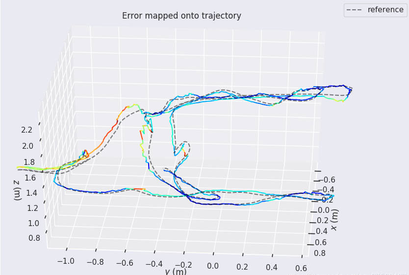
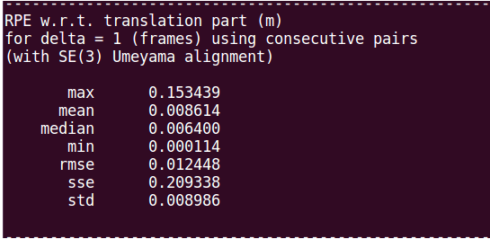

# EVO - SLAM轨迹评估工具

-------------------------------------------------

## 1  EVO 的安装
### 1.1 更新pip

```shell
# 打开终端,笔者是在python2.7基础上更新,当然python3.5更好
pip install --user --upgrade pip
# pip安装numpy和matplotlib,使用清华的镜像
pip install --user --upgrade -i https://pypi.tuna.tsinghua.edu.cn/simple numpy
pip install --user --upgrade -i https://pypi.tuna.tsinghua.edu.cn/simple matplotlib

```

### 1.2 安装EVO

```shell
git clone https://github.com/MichaelGrupp/evo.git
cd evo
pip install -i https://pypi.tuna.tsinghua.edu.cn/simple evo --upgrade --no-binary evo

```

## 2 EVO使用
### 2.1 数据集转换格式

```shell
# euroc数据集 -> tum数据集格式文件(data.tum)
evo_traj euroc data.csv --save_as_tum     

# tum数据集 -> kitti数据集格式文件(*.kitti)
evo_traj tum traj_1.txt traj_2.txt traj_3.txt --save_as_kitti   

# tum数据集 -> ROS　bag文件格式(<时间戳>.bag)
evo_traj tum traj_1.txt traj_2.txt traj_3.txt --save_as_bag
```

> 相互转换图解:


### 2.2 evo命令格式
```shell
command  bag  bagfile-path  reference-topic  estimated-topic   [options]

 -  command：指令(evo_traj、evo_ape、evo_rpe)
 -  bag：数据集名称(euroc、kitti、tum) 
 -  bagfile-path：文件所在路径(参考和估计文件在同一文件夹下)
 -  reference-topic：真实值
 -  estimated-topic：估计值
 -  [options]： 其他参数选项(-a、-s、-as)
```

### 2.3 其他参数选项-[options]

```shell
- 自动对齐  --align 或者 -a
 - 尺度校准  --correct_scale 或者 -s
 - 自动对齐且尺度校准  --align --correct_scale 或者 -as
```

### 2.4 显示轨迹evo_traj
* 显示单轨迹

```shell
evo_traj  euroc  data.csv   -p   --plot_mode=xy
 evo_traj  tum    data.tum   -p   --plot_mode=xy
 evo_traj  tum    groundtruth.txt   -p   --plot_mode=xy
```

* 显示双轨迹(真值和估计值)

```shell
evo_traj  tum    CameraTrajectory.txt  --ref=data.tum   -p   --plot_mode=xy   -as
 evo_traj  euroc  CameraTrajectory.txt  --ref=data.csv   -p   --plot_mode=xy   -as
 等价于：
 evo_traj  tum    CameraTrajectory.txt  --ref=data.tum   -p   --plot_mode=xy  --align  --correct_scale
 evo_traj  euroc  CameraTrajectory.txt  --ref=data.csv   -p   --plot_mode=xy  --align  --correct_scale

```


### 2.5 绝对位姿误差evo_ape
```shell
evo_ape  tum     data.tum   CameraTrajectory.txt  -va   -p   --plot_mode=xyz
 evo_ape  euroc   data.csv   CameraTrajectory.txt  -va   -p   --plot_mode=xyz

```



### 2.6 相对位姿误差evo_rpe

```shell
evo_rpe  tum     data.tum   CameraTrajectory.txt   -va   -p  --plot_mode=xyz
evo_rpe  euroc   data.tum   CameraTrajectory.txt   -va   -p  --plot_mode=xyz

```





* max： 表示最大误差；
* mean：平均误差；
* median：误差中位数；
* min： 最小误差；
* rmse：均方根误差；
* sse： 和方差、误差平方和；
* std： 标准差
