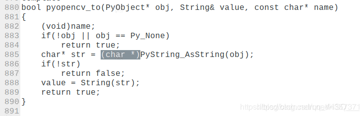

# 树莓派4 运行ORB-SLAM2

------------------------------------------------

## 1. 更换源

树莓派开机后，首先要换镜像源（本人用的清华源），如果用树莓派自带的镜像源，会出现各种依赖问题

### 1.1 查看系统版本

```shell
cat /etc/os-release
```

VERSION_ID为版本号；  
VERSION_CODENAME为版本buster（有的为stretch版本，这个要看清楚，影响后面改镜像源要输入的代码）

### 1.2 更换软件源

```shell
sudo nano /etc/apt/sources.list
```

用#注释文件中的所有内容，添加：
deb http://mirrors.tuna.tsinghua.edu.cn/raspbian/raspbian/ buster main contrib non-free rpi
deb-src http://mirrors.tuna.tsinghua.edu.cn/raspbian/raspbian/ buster main contrib non-free rpi
注意代码中的buster部分，如果第一步查看的版本不是buster，要将buster部分改为你所使用树莓派系统的版本
添加完成后，ctrl+o保存，然后点击回车，再ctrl+x退出

### 1.3 更换系统源

```shell
sudo nano /etc/apt/sources.list.d/raspi.list
```

用#注释文件中的所有内容，添加：
deb http://mirrors.tuna.tsinghua.edu.cn/raspberrypi/ buster main ui
deb-src http://mirrors.tuna.tsinghua.edu.cn/raspberrypi/ buster main ui
添加完成后，ctrl+o保存，然后点击回车，再ctrl+x退出


### 1.4 更新树莓派数据

```shell
sudo apt-get update
```

更新，至此，换源过程已完成

## 2 安装eigen

### 2.1 安装相关依赖

```shell
sudo apt-get install libboost-all-dev libblas-dev liblapack-dev
```

### 2.2 安装eigen

```shell
sudo apt-get install libeigen3-dev
```

## 3 安装opencv

### 3.1 安装相关依赖

```shell
sudo apt-get install build-essential libgtk2.0-dev libvtk5-dev libjpeg-dev libtiff4-dev libjasper-dev libopenexr-dev libtbb-dev
```

可能在安装时会提醒你更换依赖项版本，你更换成提供的相应版本就可以了

### 3.2 安装opencv

进入到下载的opencv文件夹中

```shell
mkdir build
cd build
cmake -D CMAKE_BUILD_TYPE=RELEASE -D CMAKE_INSTALL_PREFIX=/usr/local -D WITH_FFMPEG=OFF .. -DENABLE_PRECOMPILED_HEADERS=OFF

```

cmake过程出现错误可参考 [这里...](https://blog.csdn.net/qq_17783559/article/details/81462599) 

cmake成功后，输入：

```shell
make -j8
```

需要等待很长时间，可能会出现

…cv2.cpp.o] Error 1



具体可参考 [可参考该博客](https://blog.csdn.net/qq_44357371/article/details/105966714)

make需要等很长时间，编译完成后，一定一定要记得输入：

```shell
sudo make install
```

这样才能将opencv安装到树莓派上

## 3 安装pangolin

### 3.1 安装依赖

```shell
sudo apt-get install libglew-dev
```

### 3.2 安装pangolin

进入到pangolin文件夹，依次输入：

```shell
mkdir build   
cd build  
cmake -DCPP11_NO_BOOST=1 ..   
make -j
```

在make时可能出现错误，参考 [这里...](https://blog.csdn.net/limhsysu/article/details/84959736)

问题：/home/micoarm/Pangolin/include/pangolin/video/drivers/ffmpeg.h:143:5: error: ‘PixelFormat’ does not name a type
PixelFormat fmtdst;
make[2]: *** [src/CMakeFiles/pangolin.dir/video/video_output.cpp.o] Error 1
make[2]: Leaving directory /home/micoarm/Pangolin/build’ make[1]: *** [src/CMakeFiles/pangolin.dir/all] Error 2 make[1]: Leaving directory/home/micoarm/Pangolin/build’
make: *** [all] Error 2***

**解决办法：**打开Pagolin/src/CMakeList.txt，将
find_package(FFMPEG QUIET)模块的所有部分注释掉.

编译完成后，输入

```shell
sudo make install 
```


## 4 编译orb-slam2

```shell
cd ORB_SLAM2
chmod +x build.sh
./build.sh
```

可能会出现一些错误

* usleep未定义：
  对相应文件增加
> #include<unistd.h>

* 编译ORB-SLAM2出现fatal error config.h没有那个文件或目录
  根据ORB-SLAM2主文件夹下面的build.sh里面的步骤配置cmake make 或者直接运行build.sh


## 5 运行ORB-SLAM2

### 5.1 Monocular Examples

#### 5.1.1 TUM Dataset
* Download a sequence from [http://vision.in.tum.de/data/datasets/rgbd-dataset/download](http://vision.in.tum.de/data/datasets/rgbd-dataset/download) and uncompress it.
* Execute the following command. Change TUMX.yaml to TUM1.yaml,TUM2.yaml or TUM3.yaml for freiburg1, freiburg2 and freiburg3 sequences respectively. Change PATH_TO_SEQUENCE_FOLDERto the uncompressed sequence folder.

```shell
./Examples/Monocular/mono_tum Vocabulary/ORBvoc.txt Examples/Monocular/TUMX.yaml PATH_TO_SEQUENCE_FOLDER
```

#### 5.1.2 KITTI Dataset

* Download the dataset (grayscale images) from [http://www.cvlibs.net/datasets/kitti/eval_odometry.php](http://www.cvlibs.net/datasets/kitti/eval_odometry.php)
* Execute the following command. Change KITTIX.yamlby KITTI00-02.yaml, KITTI03.yaml or KITTI04-12.yaml for sequence 0 to 2, 3, and 4 to 12 respectively. Change PATH_TO_DATASET_FOLDER to the uncompressed dataset folder. Change SEQUENCE_NUMBER to 00, 01, 02,.., 11.

```shell
./Examples/Monocular/mono_kitti Vocabulary/ORBvoc.txt Examples/Monocular/KITTIX.yaml PATH_TO_DATASET_FOLDER/dataset/sequences/SEQUENCE_NUMBER
```

#### 5.1.3 EuRoC Dataset

* Download a sequence (ASL format) from [http://projects.asl.ethz.ch/datasets/doku.php?id=kmavvisualinertialdatasets](http://projects.asl.ethz.ch/datasets/doku.php?id=kmavvisualinertialdatasets)
* Execute the following first command for V1 and V2 sequences, or the second command for MH sequences. Change PATH_TO_SEQUENCE_FOLDER and SEQUENCE according to the sequence you want to run.

```shell
Execute the following first command for V1 and V2 sequences, or the second command for MH sequences. Change PATH_TO_SEQUENCE_FOLDER and SEQUENCE according to the sequence you want to run.
```

```shell
./Examples/Monocular/mono_euroc Vocabulary/ORBvoc.txt Examples/Monocular/EuRoC.yaml PATH_TO_SEQUENCE/cam0/data Examples/Monocular/EuRoC_TimeStamps/SEQUENCE.txt 
```

### 5.2 Stereo Examples
#### 5.2.1 KITTI Dataset
* Download the dataset (grayscale images) from [http://www.cvlibs.net/datasets/kitti/eval_odometry.php](http://www.cvlibs.net/datasets/kitti/eval_odometry.php)
* Execute the following command. Change KITTIX.yamlto KITTI00-02.yaml, KITTI03.yaml or KITTI04-12.yaml for sequence 0 to 2, 3, and 4 to 12 respectively. Change PATH_TO_DATASET_FOLDER to the uncompressed dataset folder. Change SEQUENCE_NUMBER to 00, 01, 02,.., 11.

```shell
./Examples/Stereo/stereo_kitti Vocabulary/ORBvoc.txt Examples/Stereo/KITTIX.yaml PATH_TO_DATASET_FOLDER/dataset/sequences/SEQUENCE_NUMBER
```

#### 5.2.2 EuRoC Dataset
* Download a sequence (ASL format) from [http://projects.asl.ethz.ch/datasets/doku.php?id=kmavvisualinertialdatasets]（http://projects.asl.ethz.ch/datasets/doku.php?id=kmavvisualinertialdatasets）
* Execute the following first command for V1 and V2 sequences, or the second command for MH sequences. Change PATH_TO_SEQUENCE_FOLDER and SEQUENCE according to the sequence you want to run.

```shell
./Examples/Stereo/stereo_euroc Vocabulary/ORBvoc.txt Examples/Stereo/EuRoC.yaml PATH_TO_SEQUENCE/mav0/cam0/data PATH_TO_SEQUENCE/mav0/cam1/data Examples/Stereo/EuRoC_TimeStamps/SEQUENCE.txt
```

```shell
./Examples/Stereo/stereo_euroc Vocabulary/ORBvoc.txt Examples/Stereo/EuRoC.yaml PATH_TO_SEQUENCE/cam0/data PATH_TO_SEQUENCE/cam1/data Examples/Stereo/EuRoC_TimeStamps/SEQUENCE.txt
```

### 5.3 RGB-D Example
#### 5.3.1 TUM Dataset
* Download a sequence from [http://vision.in.tum.de/data/datasets/rgbd-dataset/download](http://vision.in.tum.de/data/datasets/rgbd-dataset/download) and uncompress it.
* Associate RGB images and depth images using the python script [associate.py](https://vision.in.tum.de/data/datasets/rgbd-dataset/tools). We already provide associations for some of the sequences in Examples/RGB-D/associations/. You can generate your own associations file executing:

```python
python associate.py PATH_TO_SEQUENCE/rgb.txt PATH_TO_SEQUENCE/depth.txt > associations.txt
```

* Execute the following command. Change TUMX.yaml to TUM1.yaml,TUM2.yaml or TUM3.yaml for freiburg1, freiburg2 and freiburg3 sequences respectively. Change PATH_TO_SEQUENCE_FOLDERto the uncompressed sequence folder. Change ASSOCIATIONS_FILE to the path to the corresponding associations file.

```shell
./Examples/RGB-D/rgbd_tum Vocabulary/ORBvoc.txt Examples/RGB-D/TUMX.yaml PATH_TO_SEQUENCE_FOLDER ASSOCIATIONS_FILE
```

## 6 ROS Examples

> ......